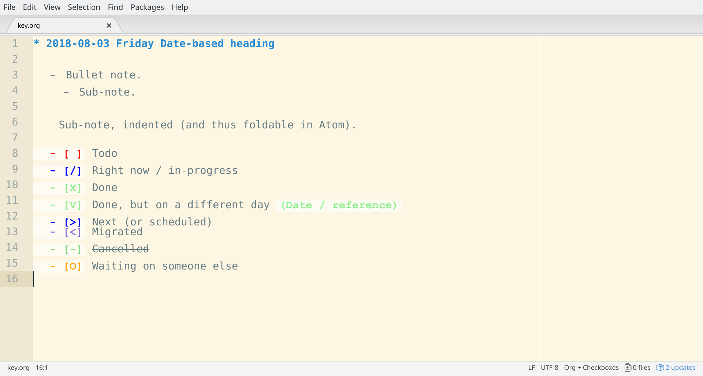

# Atom language-org-checkboxes

## Description

This grammar for the [Atom text editor](https://atom.io/) adds coloring for unordered list checkboxes in `org-mode` text. This facilitates creating simple [Bullet Journal](http://bulletjournal.com/) files using []`org-mode` syntax](http://ergoemacs.org/emacs/emacs_org_markup.html).

The package is written by [Jacob Levernier](https://adunumdatum.org), and is based on Dmitriy Kiyatkin's [language-todo-extra-words](https://github.com/dkiyatkin/atom-language-todo-extra-words).

It highlights the following:

- `- []`, `- [ ]`: Todo
- `- [X]`, `- [x]`: Done
- `- [7]`: Done, but on a different day (Date or reference goes in parentheses at the end of the line)
- `- [>]`: Next / Scheduled
- `- [<]`: Migrated
- `- [/]`: Right now / In progress
- `- [O]`, `- [0]`, `- [o]`: Waiting on someone else



The package also renders highlighting for `org-mode` syntax.

## Use

In Atom, set the language for the document as `Org + Checkboxes`.

I recommend this style for bullet-journal entries:

```org
* 1970-01-01 Thursday

  - [ ] Item 1
    - [ ] Sub-item 1
  - [ ] Item 2

  - O Event 1
  - O Event 2

  - Note 1
    - Sub-note 1
      #+BEGIN_QUOTE
        Some block-quote contents.
      #+END_QUOTE
```

By indenting, you can use Atom's `Editor: Fold Current Row` / `Editor: Unfold Current Row` commands (from the `Ctrl + P` / `Cmd + P` menu) to collapse sections of your journal for easier reading.

This approach also works well with the [`orgfld`](https://atom.io/packages/orgfld) package for Atom, which enables folding for org-mode syntax headers. Further, it works well with [`Orgzly`](http://www.orgzly.com/) for Android, which can sync org-mode files using a service such as [Dropbox](https://www.dropbox.com) or [SyncThing](https://syncthing.net/), and allows checking boxes with a tap.

Using the contents of the `extras` directory contained in this repository, one can also convert org-mode files created using the above approach into HTML files ready to print. After installing [Pandoc](https://pandoc.org/installing.html), one can run the following from the command line, from the directory of this repository:

```sh
pandoc \
--self-contained \
--css extras/org-print-stylesheet.css \
--include-in-header extras/org-print-coloring.html \
extras/example.org \
-o extras/example_output.html
```

You can view the output of this in `extras/example_output.html`.

## Local development and installation

To install this locally, run `apm link` in the command line from this project's directory. If you then run `atom -d` (for development mode), after each `apm link`, you can use `Ctrl + Shift + P` and then select `Dev Live Reload: Reload All` to see your changes reflected.
